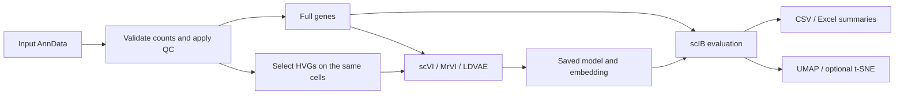

# A hyperparameter benchmark of VAE-based methods for scRNA-seq batch integration

Code for benchmarking **scVI**, **MrVI**, and **LDVAE** across architecture settings and full-gene versus highly variable gene (HVG) inputs.

Publication: [bioRxiv, 10.64898/2026.02.10.705093, version 1](https://www.biorxiv.org/content/10.64898/2026.02.10.705093v1.full). The [complete shared results workbook](https://docs.google.com/spreadsheets/d/1CQmClzXN4-6QW-gKKCPw9hVGqo6BKIk0/edit) contains the three human-dataset sweeps; the paper also reports Tabula Muris.

The root [Snakefile](Snakefile) runs all three models through shared preprocessing, training, scIB evaluation, and reporting. Each architecture, feature set, and seed has its own outputs. Completed jobs are reused when their inputs and settings have not changed.



## Quick start

Run these commands on the machine where you will perform the benchmark. The supplied environments target Linux x86_64. Data files are supplied separately.

```bash
GIT_LFS_SKIP_SMUDGE=1 git clone https://github.com/Kassab11/A-hyperparameter-benchmark-of-VAE-based-methods-for-scRNA-seq-batch-integration.git
cd A-hyperparameter-benchmark-of-VAE-based-methods-for-scRNA-seq-batch-integration
conda env create -f environment.yml
conda activate scrna-benchmark
```

Skipping Git LFS downloads is optional; the historical notebooks are not required by the workflow.

Edit [config/config.yaml](config/config.yaml): set the paths to your `.h5ad` files and confirm their count sources and metadata columns. The default selects Human Immune, all three models, full genes and 5,000 HVGs, one architecture, seed 0, and 200 epochs: **six training jobs**. It uses the CPU.

From the repository root, inspect the planned jobs, then run them:

```bash
snakemake --cores 4 --dry-run
snakemake --cores 4 --resources mem_mb=64000 --rerun-incomplete
```

`--cores` limits concurrent CPU work; the global `mem_mb` resource limits scheduling according to the per-rule estimates in the configuration. Adjust both for your machine and dataset. Rerun the same command after an interruption to resume completed stages; an interrupted training job starts that model again.

### NVIDIA GPU

MrVI in scvi-tools 1.3.0 uses **JAX**, while scVI and LDVAE use **PyTorch**. The GPU environment installs CUDA support for both. A compatible NVIDIA driver for CUDA 12 is required.

```bash
conda env create -f envs/gpu.yaml
conda activate scrna-benchmark-gpu
CUDA_VISIBLE_DEVICES=0 snakemake --cores 8 --resources gpu=1 mem_mb=64000 \
  --config accelerator=gpu environment=envs/gpu.yaml --rerun-incomplete
```

Keep `gpu=1` for a single GPU: each training job requests one GPU, so model trainings run sequentially on it. CPU preprocessing and evaluation can run alongside training. This workflow selects one visible GPU per process; it does not assign several GPUs to concurrent jobs automatically. MrVI's Lightning log may say the trainer uses CPU even when the JAX model is on GPU; the model backend is recorded in `training.json`.

The commands above use your activated environment. To let Snakemake create the declared rule environment instead, add `--use-conda`; Snakemake and Conda must already be available in the launching environment. Core versions are pinned to the publication's API generation: Python 3.12.2, scvi-tools 1.3.0, Scanpy 1.11.0, PyTorch 2.6.0, JAX 0.4.35, scIB 1.1.7, and Snakemake 9.11.5.

## Select models and the architecture grid

Use lowercase model IDs `scvi`, `mrvi`, and `ldvae`. Settings can be edited in the YAML file or supplied as Snakemake overrides:

```bash
# Only scVI, using the default architecture and both feature sets
snakemake --cores 4 --config models='[scvi]'

# All three models, using HVGs only
snakemake --cores 4 --config features='[hvg]'

# Preview the full four-dataset publication architecture grid
snakemake --configfile config/benchmark.yaml --cores 8 --dry-run

# Run that grid on one GPU
CUDA_VISIBLE_DEVICES=0 snakemake --configfile config/benchmark.yaml \
  --cores 8 --resources gpu=1 mem_mb=64000 \
  --config accelerator=gpu environment=envs/gpu.yaml --rerun-incomplete
```

[config/benchmark.yaml](config/benchmark.yaml) overrides the defaults; fields it omits are inherited from `config/config.yaml`.

| Axis | Publication grid |
|---|---|
| Hidden width | 128, 256 |
| Latent dimension `n_latent` | 10, 20, 30, 40, 50 |
| Encoder layers | 1, 2, 3 |
| MrVI `n_latent_u` | 10, 20 |
| Features | Full genes, top 5,000 HVGs |
| Seed | 0 by default; edit `seeds` to repeat the grid |

This expands to **30 scVI + 60 MrVI + 30 LDVAE architectures**, each with two feature sets. Four datasets give **960 training jobs per seed**. Selecting only `human_immune`, `capillary_blood`, and `remission_biome` gives the **720-job** human-dataset grid. `n_latent_u` expands only MrVI runs.

The model adapters use `scvi.model.SCVI`, `scvi.external.MRVI`, and `scvi.model.LinearSCVI` respectively. LDVAE's grid changes encoder depth; its decoder remains linear. MrVI receives `encoder_n_hidden` and `encoder_n_layers`, and registers both the batch and sample columns. Its default output is the sample-independent **u** representation, matching `get_latent_representation()` in scvi-tools 1.3.0. Set `training.mrvi_representation: z` to export z instead; the selected representation and its actual dimension are recorded with each run.

## Data configuration

Download the appropriate annotated AnnData inputs from their original sources, then set their paths in the configuration. No downloads or credentials are embedded in the workflow. Absolute paths and paths containing spaces are supported.

| Dataset ID | Source | Counts | Batch column | MrVI sample column | Cell-type column |
|---|---|---|---|---|---|
| `human_immune` | [OpenProblems Human Immune](https://openproblems.bio/datasets/openproblems_v1/immune_cells) | `.layers["counts"]` | `batch` | `sample_ID` | `cell_type` |
| `capillary_blood` | [Zenodo 8020792, 24 PBMC samples](https://doi.org/10.5281/zenodo.8020792) | `.X` | `run_lane_batch` | `Participant IDs` | `cell_type_level_3` |
| `remission_biome` | [Zenodo 11100300, 18 PBMC samples](https://doi.org/10.5281/zenodo.11100300) | `.X` | `library` | `participant_id` | `cell_type` |
| `tabula_muris` | [Tabula Muris](https://biohub.org/sf/tabula-muris/) | `.raw.X` in the configured processed file | `batch` | Derived from `mouse.id` and `tissue` | `cell_ontology_class` |

These column mappings describe the inputs used by this project. If a download has different annotations, update the mapping. The Zenodo datasets may require an access request through their source records.

For another dataset, add an entry under `datasets`, then include its ID in `selected_datasets`. Each selected entry needs `path`, `counts_layer`, `batch_key`, and `label_key`; MrVI also requires `sample_key`. `counts_layer` accepts a layer name, `X`, or `raw`. Optional `sample_columns` derives the configured sample column from a combination of existing metadata columns. Optional `gene_symbol_key` identifies a `.var` column for mitochondrial gene detection when gene names are IDs.

Preprocessing validates all counts as finite, nonnegative integers. It rejects normalized expression selected as counts, drops cells missing required metadata, applies configured label exclusions, and filters cells using per-batch gene-count and total-count quantiles. Genes must be expressed in at least three cells by default. The capillary and remission exclusions are recorded in the supplied configuration. No doublet removal or mitochondrial-percentage cutoff is applied by default; `max_mito_pct` enables the latter explicitly.

Full and HVG inputs are derived from the **same retained cells**. HVGs use batch-aware `seurat_v3` selection on counts. Selecting HVGs cannot silently turn a full-gene job into an HVG job. Preprocessing records input size and modification time, QC thresholds, cell/gene counts, and ordered cell/gene ID hashes.

## Outputs and scoring

The default output directory is `results/`; the complete-grid override uses `results/benchmark/`.

```text
results/
├── prepared/<dataset>/
│   ├── full.h5ad / full.json
│   └── hvg.h5ad / hvg.json
├── runs/<dataset>/<full|hvg>/<scvi|mrvi|ldvae>/<run_id>/
│   ├── model/                  # Saved model, training history, LDVAE gene loadings
│   ├── embedding.h5ad          # Cell annotations and latent embedding
│   ├── training.json           # Architecture, seed, versions, timing, memory, provenance
│   ├── train_benchmark.tsv     # Snakemake process timing and resource measurements
│   ├── evaluated.h5ad          # Embedding, neighbor graph, clustering, metric metadata
│   ├── metrics.json            # Scores plus explicit metric status/reason
│   └── umap.png                # Optional tsne.png; set plots: [] to skip plots
├── summary/
│   ├── results.csv / results.xlsx
│   ├── best_runs.csv           # Best configuration per dataset, model, and seed
│   ├── metric_status.tsv
│   └── config.json             # Effective configuration used for this summary
└── logs/                       # Separate logs for each stage and run
```

For example, `h128_z30_l1_u20_s0` denotes a MrVI run with hidden width 128, z dimension 30, one encoder layer, u dimension 20, and seed 0. Other models omit the u component.

Embedding files intentionally omit the expression matrix to avoid storing it hundreds of times. Read them with `anndata.read_h5ad()` and access `.obsm["X_scVI"]`, `.obsm["X_mrVI"]`, or `.obsm["X_ldvae"]`. To reload a saved model, pass the matching prepared full/HVG AnnData to the corresponding model class's `load()` method. LDVAE additionally exports `model/gene_loadings.csv`.

Evaluation computes four batch metrics (Batch ASW, PCR Batch, iLISI, graph connectivity) and up to seven biology metrics (NMI, ARI, Label ASW, isolated-label F1, isolated-label ASW, cLISI, trajectory conservation). NMI selects the Leiden resolution from the configured candidates. Neighbor-based metrics use the graph built from the chosen latent representation. PCR compares against the full-gene pre-integration reference for both feature sets; `pcr_input: counts` is the historical convention, with `log_normalized` available explicitly.

```text
Overall Batch = mean(applicable batch metrics)
Overall Bio   = mean(applicable biology metrics)
Overall       = 0.5 × Overall Batch + 0.5 × Overall Bio
```

Isolated-label metrics are unavailable when every label occurs in every batch. Trajectory conservation requires a varying reference pseudotime annotation; it is not inferred from cell-type names. Dataset-specific configuration can disable these metrics, as supplied for Tabula Muris. Every omitted metric receives a status and reason, and metric counts accompany the composite scores.

With `strict_metrics: true`, unexpected metric errors fail evaluation and remain visible in the log. Setting it to `false` records failed metrics but leaves the affected group and overall score blank. Failed metrics are never silently dropped to improve an average. Compare overall scores only when the metric sets are comparable.

CPU runs leave GPU memory blank. GPU runs record PyTorch peak allocated memory or JAX peak bytes in use when available, along with the measurement method; these allocator statistics are not interchangeable. Training time includes completed backend work, with JAX synchronization before stopping the timer.

For very large inputs, `evaluation.max_cells` enables a seeded evaluation subset shared between the embedding and reference. It leaves training unchanged and records the subset size and ID hash. Subsampled results should be identified separately from the full-cell benchmark. Change metric settings to rerun evaluation without retraining; changing training settings reuses the same run directory and reruns the affected stages. Use another `output_dir` to retain both experiments.

## Validation to run on the execution machine

The unified workflow, environment installation, and checks below have **not been executed as part of this update**. Start with the supplied synthetic smoke run before launching a dataset sweep.

```bash
python -m unittest discover -s tests -v
python scripts/make_test_data.py --output .test-data/smoke.h5ad
snakemake --configfile config/smoke.yaml --cores 2 --dry-run
snakemake --configfile config/smoke.yaml --cores 2 --rerun-incomplete
```

The synthetic input has 360 cells, 512 genes, six samples, two batches, and three cell types. [config/smoke.yaml](config/smoke.yaml) trains all three models on both feature sets for two epochs, then evaluates and plots them. Its scores have no biological interpretation. Inspect `results/smoke/summary/results.csv` for six rows and the stage logs for errors. This CPU smoke run does not validate GPU execution; repeat it with the GPU environment and the GPU overrides above to exercise both CUDA backends.

The unit checks cover grid expansion, independent random seeds, missing MrVI sample settings, raw-count input handling, sample derivation, and composite-score error handling. They complement the end-to-end smoke run.

## Historical code and published results

This workflow refactors the archived analysis into explicit, configurable stages. It corrects model imports, full/HVG selection, sample/batch registration, and backend-specific instrumentation. These changes, input versions, and backend nondeterminism can change scores; matching the architecture grid does not establish exact reproduction of the published tables.

The original [MrVI_snakemake](MrVI_snakemake/) scripts, [notebooks](notebooks/), and [Results](Results/) remain available. The previous root entry point is preserved in [legacy/pipeline.py](legacy/pipeline.py), and the original machine-specific Conda export is in [envs/publication-export.yml](envs/publication-export.yml). Use the root `Snakefile` and the portable environment recipes for new runs. The unified workflow generates model results; historical baseline comparisons remain in the published results workbook.

Please cite the [related publication](https://doi.org/10.64898/2026.02.10.705093) and the original methods and datasets when using this benchmark.
